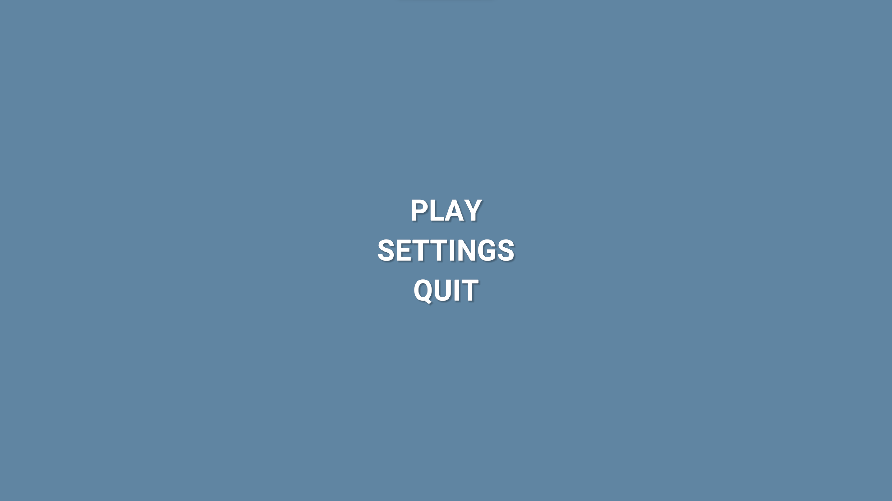
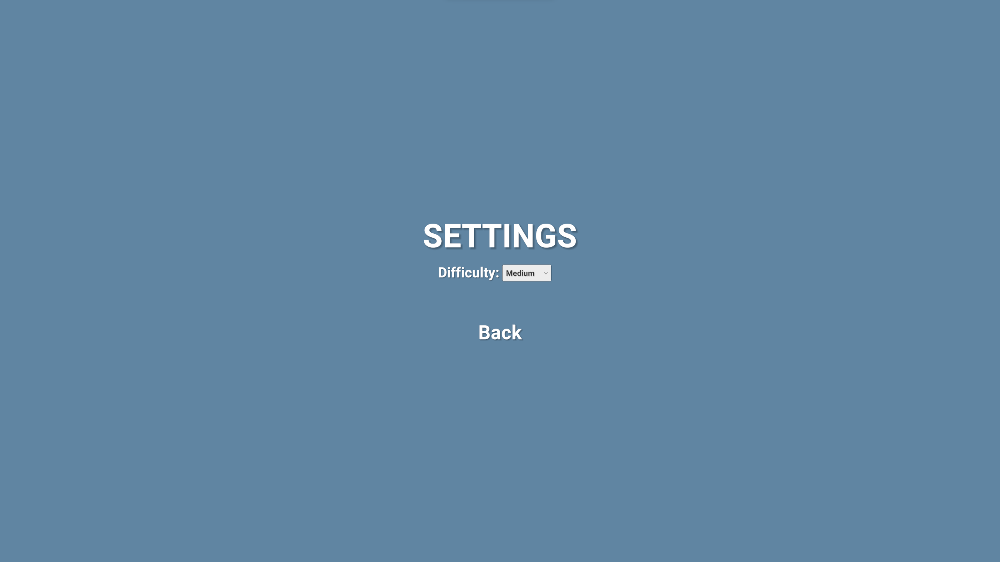
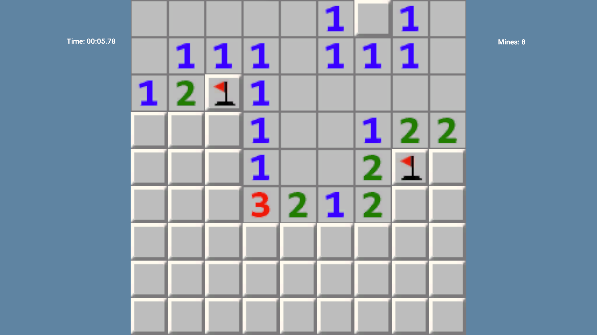
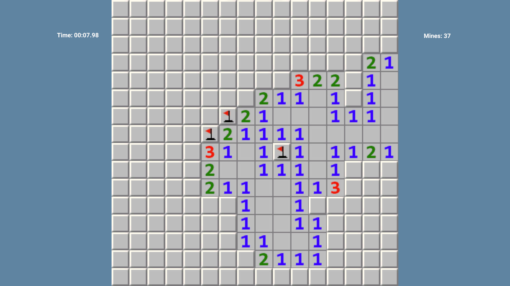
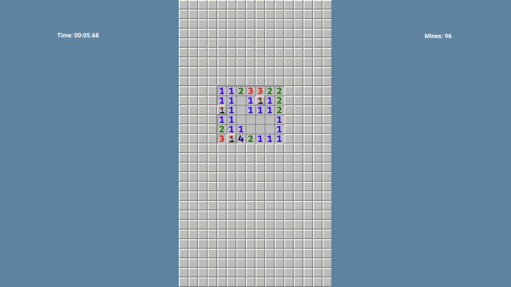
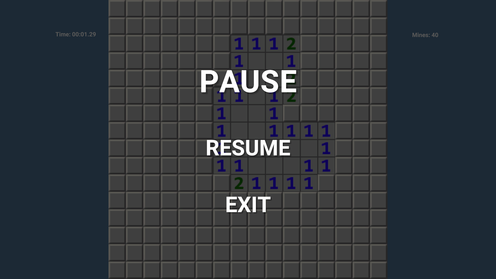
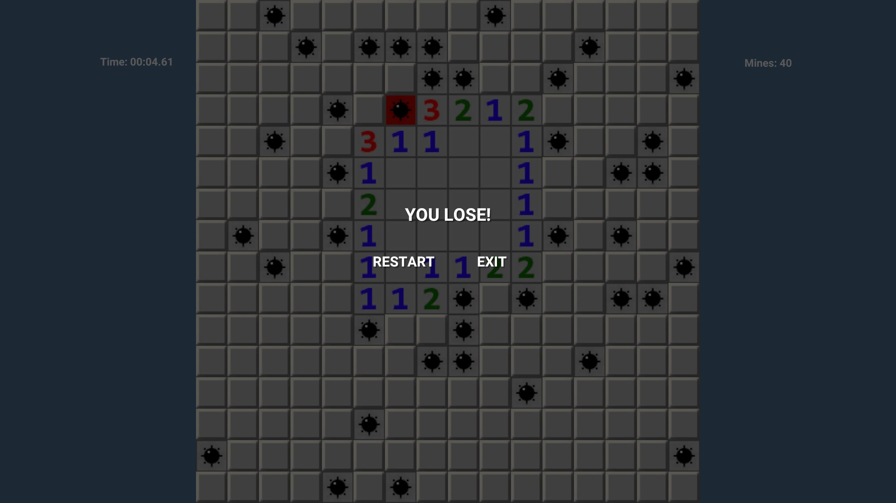
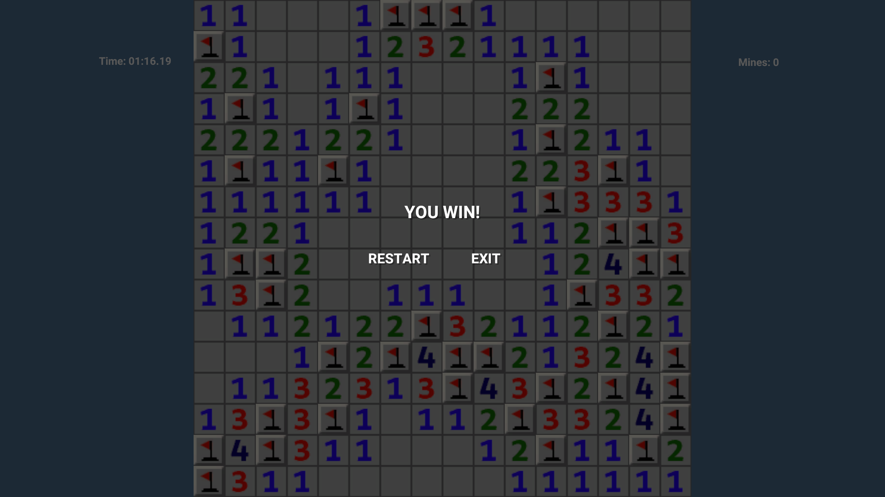

# Minesweeper game.

## This is a game for software engineering coursework.

### Language and tools used

- C#
- Visual Studio
- Unity Engine

### Description

Minesweeper is a classic puzzle game where players uncover a minefield while avoiding hidden mines. Using logical thinking and deduction, players reveal cells, which display numbers indicating nearby mines. The goal is to mark all mines correctly and uncover all safe cells without triggering any mines. It's a challenging and addictive game that tests your logic and decision-making skills.

- To Download Playable Build click [Download](https://drive.google.com/drive/folders/1EMdyuKY8IHK-GXCwjg4OEIe7NxVESu8t?usp=sharing).
- Extract the **Minsweeper.zip** for Playable Content
- Open Extracted Folder Than double Click on **Minsweeper.exe** to play game.
- Enjoy the Game!.

Main menu:

Settings menu:

Easy difficulty:

Medium difficulty:

Hard difficulty:

Pause menu:

Lose menu:

Win menu:

### Files description

- Assets\Scripts\Cell.cs - struc that contains the state of the cell.
- Assets\Scripts\GameBoard.cs - script that is responsible for rendering the game board.
- Assets\Scripts\Game.cs - class that implements the game logic.
- Assets\Scripts\GameController.cs - script that handles player actions.
- Assets\Scripts\Settings.cs - static class that stores game settings for access from different scenes.
- Assets\Scripts\Timer.cs - script that is responsible for the game stopwatch.
- Assets\Scripts\MinesCounterScript.cs - script that is responsible for displaying the number of remaining mines.
- Assets\Scripts\PauseMenu.cs - pause menu script.
- Assets\Scripts\MainMenu.cs - main menu script.
- Assets\Scripts\GameOver.cs - game over menu script.
- Assets\Scripts\SettingsMenu.cs - settings menu script.